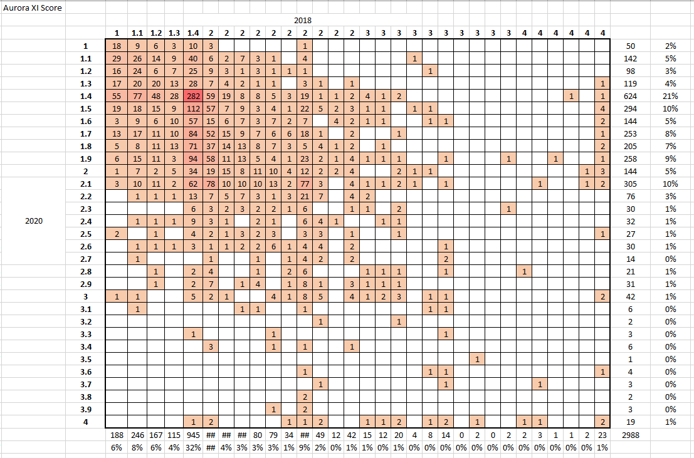
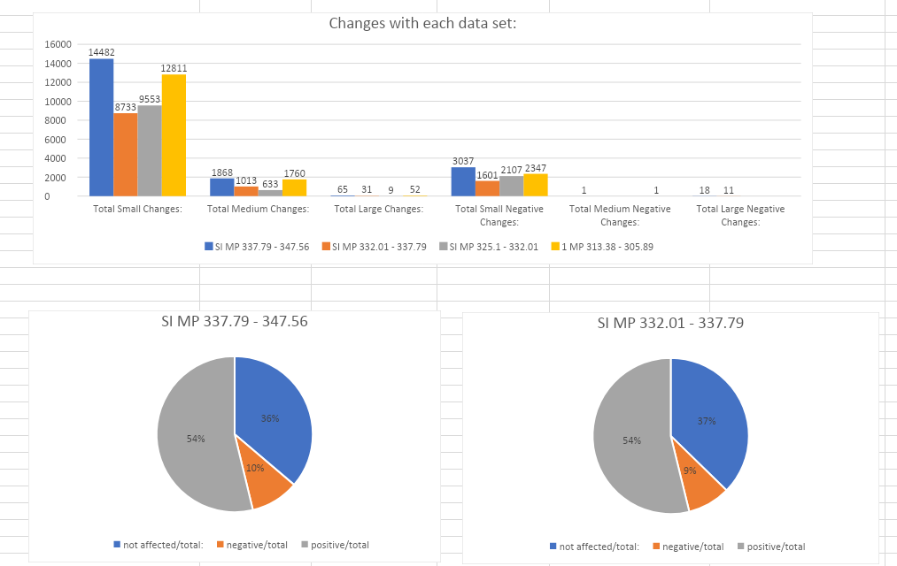

# Brittny Raup
*An Aspiring Data Analyst | Project Manager*

# Education
* Masters of Science (Data Analytics), *Texas Lutheran University*, 2017-2018
* Bachelors of Business Administration (Marketing), *Texas Lutheran University*, 2013-2017

# Skills and Experience
* Micrsoft Office, Strong organizational, time management and multitasking skills in a demanding environment.
* Excellent people skills such as training, teamwork and customer service.
*	Proficient use of computers, internet and Microsoft Office Suite.
*	Problem solving skills in Tableau, SAP, SQL, Workbench and Sharepoint.
*	Flexible and adaptable, willing to quickly learn and understand new technologies

# Project 1: Tie Grade Repeatabilty 

Photo by Brittny Raup on Excel
 
For this project I built a waffle chart to highlight the different areas of ties from 2018 to 2020. With this I wanted to identify if ties stayed the same or got worse over the course of 3 years. 
* **Excel:** Used to pull, clean data, and create visuals

# Project 2: LFD Scoring

Photo by Brittny Raup on Excel
  
This project makes use of LFD Scoring *(LFD stands for localized flaw finding).* With this we had an issue where the LFD Scoring was outside of it's parameters. I had to create an algorithm to update these parameters to match the LFD scoring to the tie as closely as possible. 
* **Issue:** LFD scoring was outside of parameters
* **Options:** Keep LFD scoring as is even though it is not accurate or find parameters that will align to scoring to be more accurate
* **Solution:** Changed parameters to a better score that identifed with for ties to be more accurate

